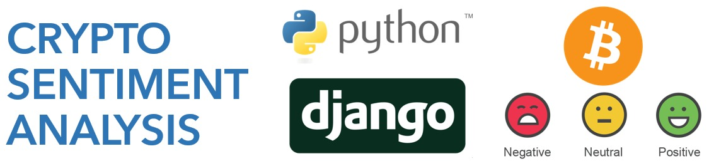

<div align="center" id="top"> 
  

  &#xa0;

  <!-- <a href="https://cryptopriceapi.netlify.app">Demo</a> -->
</div>

<h1 align="center">Crypto Price API</h1>

<p align="center">
  


  <!--  -->

  <!--  -->

  <!--  -->
</p>

<!-- Status -->

<h4 align="center"> 
	🚧  Crypto Price API 🚀 Is a personal project, it is not investment advice 🚧<br><br>
  Made by <a href="https://github.com/nfernandezsanz" target="_blank">Nicolas Fernández Sanz</a>

</h4> 

<hr>

<p align="center">
  <a href="#dart-about">About</a> &#xa0; | &#xa0; 
  <a href="#sparkles-features">Features</a> &#xa0; | &#xa0;
  <a href="#rocket-technologies">Technologies</a> &#xa0; | &#xa0;
  <a href="#white_check_mark-requirements">Requirements</a> &#xa0; | &#xa0;
  <a href="#checkered_flag-starting">Starting</a> &#xa0; | &#xa0;
  <a href="#memo-license">License</a> &#xa0; | &#xa0;
  <a href="https://github.com/{{YOUR_GITHUB_USERNAME}}" target="_blank">Author</a>
</p>

<br>

## :dart: About ##

REST API developed with Djando and Python designed to collect information about the current and historical sentiment of many cryptocurrencies using NLP models.<br>It is a personal project, which I plan to improve over time. Collaborations are welcome :).
## :sparkles: Features ##
:heavy_check_mark: Data for over 13,000+ cryptocurrencies such as Bitcoin, Ethereum, XRP and much more;\
:heavy_check_mark: 500+ sources of information;\
:heavy_check_mark: Complementary data such as polarity of the sources;\
:heavy_check_mark: Historical data storage;\
:heavy_check_mark: Easy deployment;\
:heavy_check_mark: Easy access;\
:heavy_check_mark: Clear documentation;

## :rocket: Technologies ##

The following tools were used in this project:

- [Django](https://www.djangoproject.com/)
- [Django Rest Framework](https://www.django-rest-framework.org/)
- [Python](https://www.python.org/)
- [Docker](https://www.docker.com/)

## :white_check_mark: Requirements ##

Before starting :checkered_flag:, you need to have [Git](https://git-scm.com), [Docker](https://www.docker.com/) and [Docker Compose](https://docs.docker.com/engine/reference/commandline/compose/) installed.

## :checkered_flag: Starting ##

```bash
# Clone this project
$ git clone https://github.com/nfernandezsanz/CryptoPriceAPI.git

# Access
$ cd CryptoPriceAPI/api

# Modify the Enviroment Variables
$ nano envs/db.env

# Build the container (It can take a while.. It can take a while, I suggest a coffee)
$ docker-compose build 

# Run the container
$ docker-compose up 

# The API will initialize in the <http://localhost:8000>

# Search for the container name
$ docker ps
# Navigate to the container
$ docker exec -ti {cotainer name} bash
# Load the Cryptos to the DB
$ python manage.py loadCryptos
# Create a superuser to access to the admin (http://localhost:8000/admin)
$ python manage.py createsuperuser

```

## :memo: License ##

This is a personal project part of my portfolio. Feel free to use it for good purposes and remember that cryptocurrencies are volatile, do not invest blindly.


&#xa0;

<a href="#top">Back to top</a>
